# Multi-Agent System with Computer Vision and 3D Graphics
This project implements a multi-agent system where robotic agents navigate a 3D environment to collect and deliver objects, utilizing computer vision for object detection and autonomous navigation capabilities.

link to project https://drive.google.com/drive/folders/1eZmVEiWsTU47vPOiCX8_LJxLp49Hh7Fd?usp=sharing

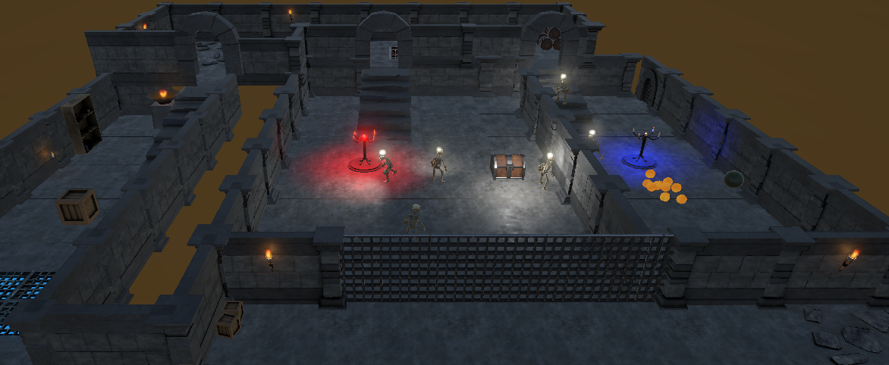
*Complete view of the dungeon environment where the robots operate*

## 📋 Project Overview
The simulation features five robot agents tasked with organizing objects in a structured environment. Each robot uses:
- Computer vision (YOLO v5) for object detection
- Autonomous navigation with NavMesh
- Real-time metrics tracking
- 3D graphics and animations in Unity

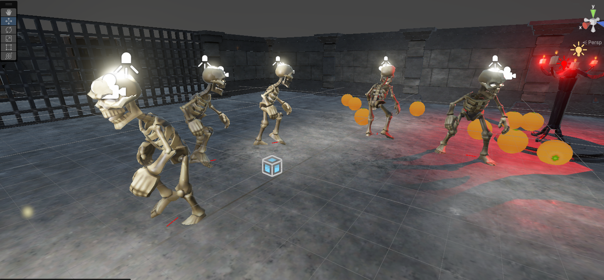
*The robot agents working together in the environment*

## 🚀 Project Structure
### Part 1: Multi-Agent System
#### Agent Properties and Environment
- **Agent Type**: Robot Agent
- **Capabilities**:
  - NavMeshAgent-based movement (15 units speed)
  - Collision detection and handling
  - Object manipulation (pick/drop)
  - Inter-agent communication
  - Obstacle jumping (jumpForce = 5f)
  - Animated movement

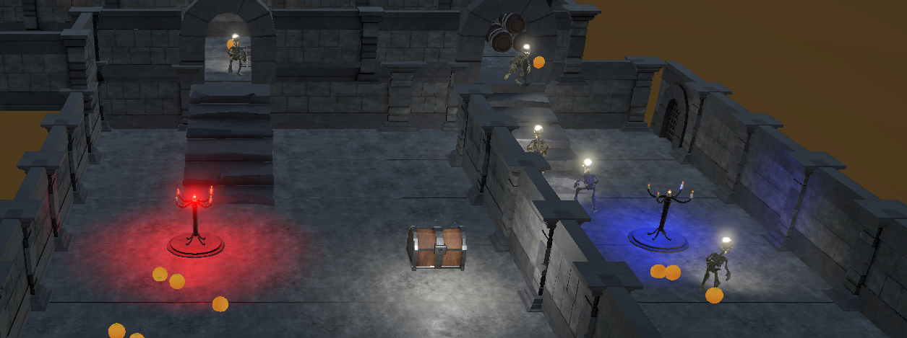
*Demonstration of the collision avoidance system*

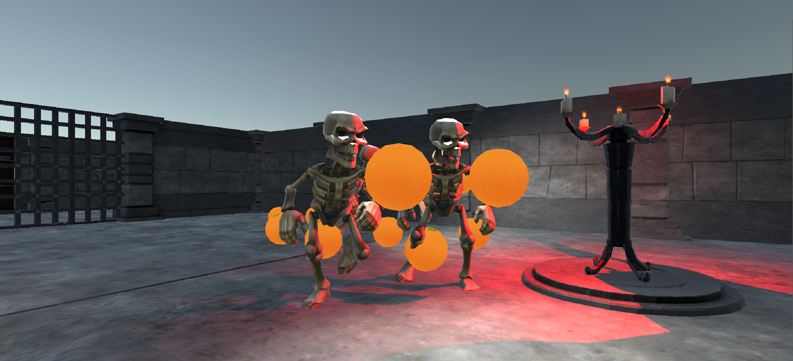
*Robot performing object collection tasks*

#### Environment Properties
- NavMesh-defined navigation space
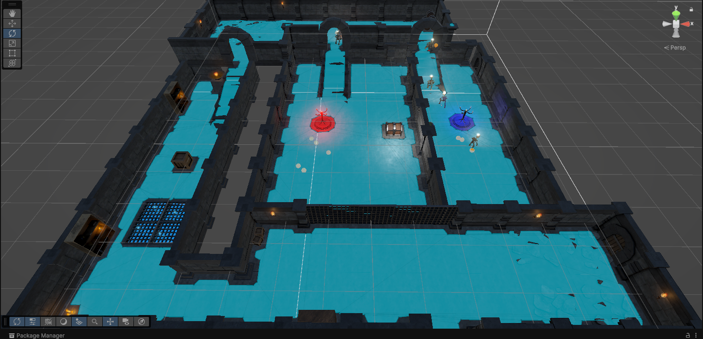
*NavMesh configuration for autonomous navigation*

- Two distinct zones:
  - Red Zone (A): Collection area (-15, -1.19, 0)
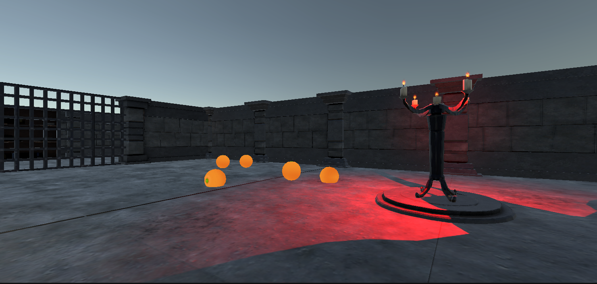
*Collection zone where objects are initially placed*

  - Blue Zone (B): Delivery area (30, -1.19, 0)
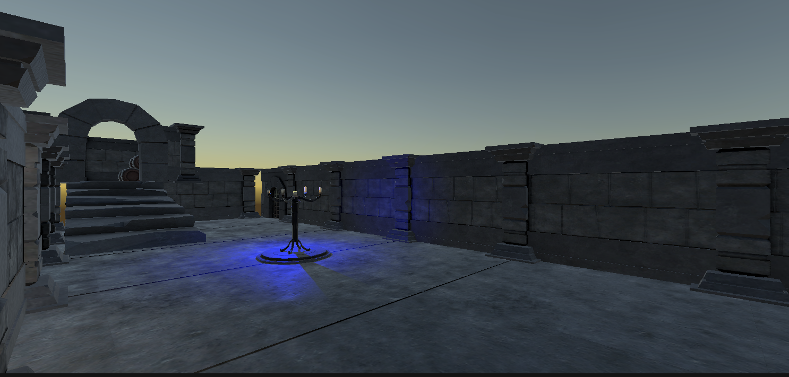
*Delivery zone where objects are transported*

- Environmental challenges:
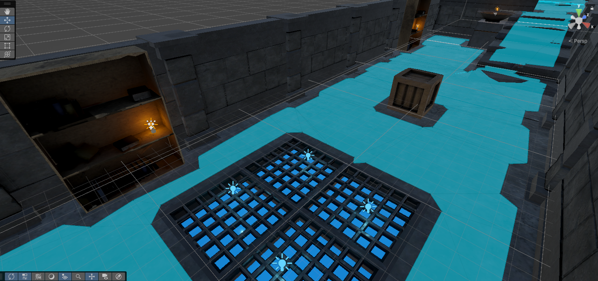
*Various obstacles and terrain challenges*

- Dungeon environment: ~120 x 25 x 180 units
- 10 randomly distributed cubes in red zone

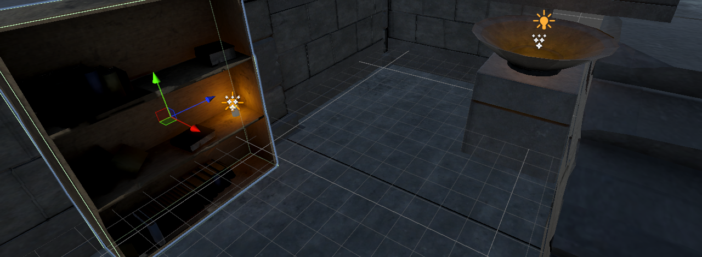
*Example of dynamic lighting implementation in the environment*

#### Performance Metrics
The system tracks:
1. Cubes Delivered
2. Total Distance Traveled
3. Efficiency Ratio (cubes/distance)
4. Delivery Rate (cubes/minute)

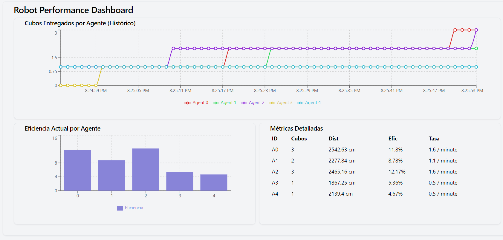
*Real-time performance metrics visualization*

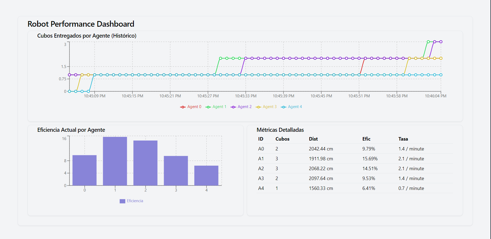
*Detailed performance analytics and agent efficiency tracking*

### Part 2: Unity 3D Implementation
Located in `/codes/`:
- `h45.cs`: Individual robot prefab controller
- `robotWorld2.cs`: World controller script
Features:
- Material and texture mapping
- Walking/running animations
- Basic collision detection
- Dynamic lighting

### Part 3: Computer Vision
Located in `/pycodes/`:
- YOLO v5 implementation
- Real-time UDP camera stream processing
- Object recognition system

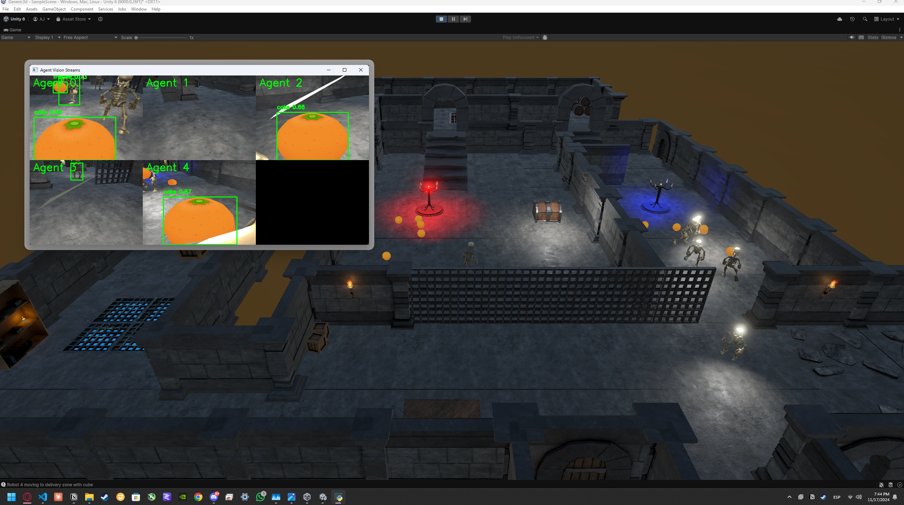
*YOLO v5 object detection in action*

### Part 4: Metrics Dashboard
Located in `/robot-dashboard/`:
- Real-time visualization of robot performance metrics
- Interactive charts and graphs
- Agent status monitoring

  

## 📦 Repository Contents
```
├── codes/
│   ├── h45.cs
│   ├── robotWorld2.cs
│   └── [other Unity scripts]
├── pycodes/
│   ├── CameraController.py
│   ├── Controller2.py
│   └── [other Python vision processing scripts]
├── robot-dashboard/
│   ├── src/
│   ├── package.json
│   └── [other web dashboard files]
├── images/
│   ├── dungeon.png
│   ├── robots.png
│   ├── metricas.png
│   ├── metricas2.png
│   ├── luces.png
│   ├── yolo.png
│   ├── EvitColizion.png
│   ├── Navmesh.png
│   ├── obstaculos.png
│   ├── recolecting.png
│   ├── zonaA.png
│   └── zonaB.png
├── Documentation.pdf
├── demo.mp4
└── project.unitypackage
```

[El resto del contenido continúa igual hasta la licencia]

## 📄 License

Copyright (c) 2024 Aarón Hernández Jiménez

All rights reserved.

This software and associated documentation files (the "Software") are protected by copyright law. No part of this Software may be reproduced, distributed, or transmitted in any form or by any means, including photocopying, recording, or other electronic or mechanical methods, without the prior written permission of the copyright holders.

Permission Restrictions:
1. The Software may not be used, copied, modified, merged, published, distributed, sublicensed, and/or sold without explicit written permission from the copyright holders.
2. Any unauthorized use, reproduction, or distribution of the Software may result in severe civil and criminal penalties, and will be prosecuted to the maximum extent possible under law.

To request permission for usage:
- Contact: 
  - Aarón Hernández Jiménez - A01642529@tec.mx
- Required Information for Request:
  - Intended use
  - Scope of usage
  - Duration of usage
  - User/Organization information

THE SOFTWARE IS PROVIDED "AS IS", WITHOUT WARRANTY OF ANY KIND, EXPRESS OR IMPLIED, INCLUDING BUT NOT LIMITED TO THE WARRANTIES OF MERCHANTABILITY, FITNESS FOR A PARTICULAR PURPOSE AND NONINFRINGEMENT. IN NO EVENT SHALL THE AUTHORS OR COPYRIGHT HOLDERS BE LIABLE FOR ANY CLAIM, DAMAGES OR OTHER LIABILITY, WHETHER IN AN ACTION OF CONTRACT, TORT OR OTHERWISE, ARISING FROM, OUT OF OR IN CONNECTION WITH THE SOFTWARE OR THE USE OR OTHER DEALINGS IN THE SOFTWARE.

## 👥 Contributors
- Aarón Hernández Jiménez (A01642529)

